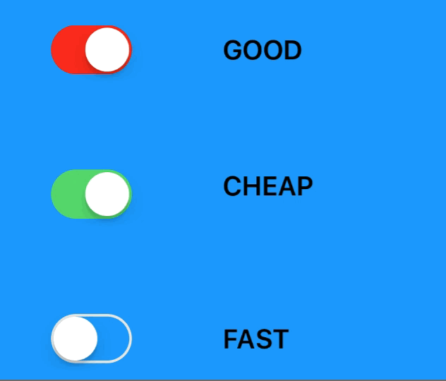

# EasyClosure

[](http://cocoadocs.org/docsets/EasyClosure)
[](https://github.com/Carthage/Carthage)
[](http://cocoadocs.org/docsets/EasyClosure)
[](http://cocoadocs.org/docsets/EasyClosure)


## Table of contents

- [Story](#story)
- [Target-Action and Delegate](#target-action-and-delegate)
- [KVO](#kvo)
- [Notification](#notification)
- [Extensible](#extensible)

## Story

There are many [Communication patterns](https://www.objc.io/issues/7-foundation/communication-patterns/)

<div align = "center">

</div>

Sometimes, you just want a unified and quick way to do it. Just call `on` on any `NSObject` subclasses and handle your events the quickest way

### Features

- [x] Shortcut to handle actions and events
- [x] Easy to extend
- [x] Correct method suggestion based on generic protocol constraint
- [x] Support iOS, macOS

### Example

<div align = "center">

</div>

We can make a fun demo of `good, cheap, fast` with `UISwitch`

```swift
func allOn() -> Bool {
  return [good, cheap, fast].filter({ $0.isOn }).count == 3
}

good.on.change {
  if allEasyClosure() {
    fast.setEasyClosure(false, animated: true)
  }
}

cheap.on.change {
  if allEasyClosure() {
    good.setEasyClosure(false, animated: true)
  }
}

fast.on.change {
  if allEasyClosure() {
    cheap.setEasyClosure(false, animated: true)
  }
}
```

## Target-Action and Delegate

#### UIControl

Works on any `UIControl` subclasses

```swift
control.on.change {
  print("control has changed")
}

refreshControl.on.change {
  print("refresh control")
}

```

#### UIButton

```swift
button.on.tap {
  print("button has been tapped")
}
```

#### UISlider

```swift
slider.on.value { value in
  print("slider has changed value")
}
```

#### UITextField

```swift
textField.on.text { text in
  print("textField text has changed")
}

textField.on.didEndEditing { text in
  print("texField has ended editing")
}
```

#### UITextView

```swift
textView.on.text { text in
  print("textView text has changed")
}
```

#### UISearchBar

```swift
searchBar.on.text { text in
  print("searchBar text has changed")
}
```

#### UIDatePicker

```swift
datePicker.on.pick { date in
  print("datePicker has changed date")
}
```

#### UIBarButtonItem

```swift
barButtonItem.on.tap {
  print("barButtonItem has been tapped")
}
```

#### UIGestureRecognizer

```swift
gestureRecognizer.on.occur {
  print("gesture just occured")
}
```

#### Timer

```swift
timer = Timer.scheduledTimer(withTimeInterval: 1, repeats: true)
timer.on.tick {
  print("tick")
}
```

## KVO

Use `observe` and `unobserve` to perform KVO. **EasyClosure** will also remove all observations upon `deinit`

```swift
viewController.on.observe(object: label, keyPath: keyPath: #keyPath(UILabel.text)) {
  print($0 as? String)
}

viewController.on.unobserve(object: label)
```


Here I use `viewController` as observer, but you can just create an `NSObject` as the observer, because `on` works on any `NSObject` subclasses

```swift
let observer = NSObject()

observer.on.observe(object: scrollView: keyPath: #keyPath(UIScrollView.contentSize)) { value in
  print($0 as? CGSize)
}
```

## Notification

Use `observe` and `unobserve` to perform observations on `NotificationCenter`. **EasyClosure** will also remove all observations upon `deinit`

```swift
viewController.on.observe(notification: Notification.Name.UIApplicationDidBecomeActive) { notification in
  print("application did become active")
}

viewController.on.unobserve(notification: Notification.Name.UIApplicationDidBecomeActive)
```

## Extensible

Extend `Container` and specify `Host` to add more functionalities to your own types. For example

```swift
public extension Container where Host: UITableView {
  func didTapEasyClosureCell(_ action: @escaping (UITableViewCell) -> Void)) {
    // Your code here here
  }
}

// usage
let tableView = UITableView()
tableView.on.didTapEasyClosureCell { cell in
  
}

```

## Installation

**EasyClosure** is available through [CocoaPods](http://cocoapods.org). To install
it, simply add the following line to your Podfile:

```ruby
pod 'EasyClosure'
```

**EasyClosure** is also available through [Carthage](https://github.com/Carthage/Carthage).
To install just write into your Cartfile:

```ruby
github "onmyway133/EasyClosure"
```

**EasyClosure** can also be installed manually. Just download and drop `Sources` folders in your project.

## Author

Khoa Pham, onmyway133@gmail.com

## Contributing

We would love you to contribute to **EasyClosure**, check the [CONTRIBUTING](https://github.com/onmyway133/EasyClosure/blob/master/CONTRIBUTING.md) file for more info.

## License

**EasyClosure** is available under the MIT license. See the [LICENSE](https://github.com/onmyway133/EasyClosure/blob/master/LICENSE.md) file for more info.
